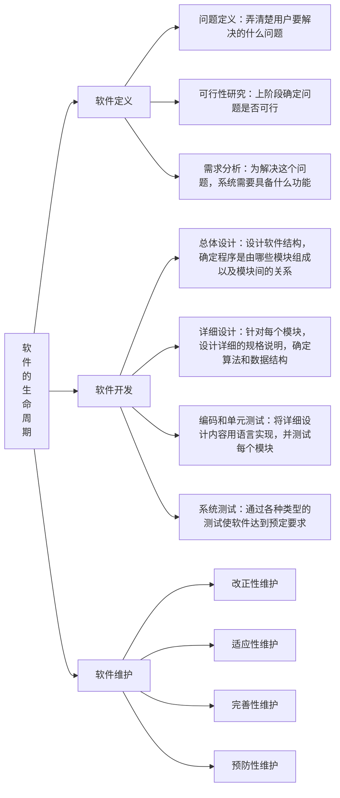

# 导言
软件工程学的概念：
软件工程即用工程、科学和数学的原则和方法研制、维护计算机软件的有关技术及方法，其优点是以较小的代价开发高质量的软件并有效地维护它。

# 软件工程学概述
## 软件
概念：软件是计算机系统中与硬件相互依存的另一部分，包括程序、数据及其相关文档的完整集合。软件=程序+数据+文档
- 数据：程序能够适当处理信息的数据结构
- 程序：能够完成预定功能和性能的可执行指令序列
- 文档：开发、使用和维护过程程序所需要的图文资料

## 软件危机（软件失效）
软件危机、软件工程产生的原因？
### 概念
软件危机指在计算机软件开发和维护过程中，所遇到的一系列严重的问题；
#### 软件危机的典型表现
1. 软件开发的预算和时间不可预测（不可控）
2. 软件质量得不到保证（不可用）
3. 维护非常困难（不可维护）

### 软件危机产生的原因
1. 与软件本身的特点有关
   - 软件规模庞大，程序复杂性随规模增加指数上升
   - 软件是一种逻辑实体，缺乏可见性，管理和控制困难
   - 软件无磨损性，软件维护意味着修改原来的设计，维护困难

2. 与软件开发和维护的方法不恰当有（主观原因）
   - 忽视需求
   - 轻视软件维护
   - 没有认识到程序只是软件的一部分
   - 没有认识到软件开始只是漫长的软件生命周期中一个比较次要的阶段
   - 越到后期引入变动付出的代价越高昂

### 消除软件危机的途径
管理+技术
1. 更正软件就是程序的概念，对计算机软件应该有正确的认识
2. 认识到软件开发是分工不同的人员之间协同配合、共同完成的工程项目，不是个人独立的劳动
3. 推广和使用在实践中总结出来的软件开发的成功技术（理论）和方法（设计方法、设计原则、设计模式）
4. 积极开发和应用更好的软件工具
5. **按照工程化的原则和方法组织软件开发工作是有效摆脱软件危机的一个主要方法**，对软件进行建模，探索更好更有效的管理措施和手段对开发过程进行控制和管理

概念：
1. 工程：将科学及数学原理运用于实际用途的应用手段，如：设计、制造、机器操纵、构架等。

软件工程的出现就来源于软件危机

## 软件工程
### 定义
目前普遍认可的对软件工程的定义：
软件工程是研究和应用以系统化、规范化的、可定量的过程化方法去**开发和维护软件**，以及如何把经过实践验证而证明正确的**管理技术**和当前能够得到的最好的**技术方法**结合起来

软件工程包括两方面内容：
1. 技术
2. 管理

### 软件工程本质特征
- 关注大型程序的构造
- 中心课题是控制复杂性
- 软件经常变化
- 开发效率很重要
- 开发人员的和谐协作是关键
- 软件需要有效支持用户
- 软件开发者替代其他领域人员创造产品

### 软件工程的基本原理
- 按软件生存期分阶段指定计划并认真实施
- 坚持进行阶段评审
- 坚持严格的产品控制
- 使用现代程序设计技术
- 用人少而精
- 承认不断改进软件工程实践的必要性

### 软件工程方法学（重点）
软件工程方法学概念：在软件生命周期全过程中使用的一整套技术方法的集合称为方法学，也称为范型

#### 三要素（重点）
1. 过程：规定了完成各项任务的工作步骤，是为了获取高质量软件所需要完成的一系列任务框架
2. 方法：完成软件开发的各项任务的技术方法，为软件开发提供了“如何做”的技术
3. 工具：计算机辅助软件工具

#### 软件工程方法学的分类（主要看前两种）
1. 结构化方法（生命周期方法学），又称为传统方法学
   - 把软件生命周期划分为多个阶段，采用结构化技术完成各个阶段的任务
   - 每个阶段开始和结束有严格标准；（面对任意两个相邻阶段而言，前一阶段的结束标准就是后一阶段的开始标准）
   - 每一个阶段结束之前都必须进行正是严格的技术审查和管理复审
    优点：
    分解任务、分工合作，降低整个软件开发工程的复杂度
    采用科学的管理技术和良好的技术方法对每个阶段成果都进行严格审查，保证了软件质量
    缺点：
    要尽早确定需求
    对分析和设计人员要求较高
2. 面向对象方法
  模拟人类习惯的思维方式，使软件开发的方法与过程尽可能接近人们认识世界解决问题的方法与过程，从而使得问题空间与解空间在结构上尽可能一致
  **要点**：
  - **把对象作为**融合了数据以及在数据上的操作行为的统一的**软件构件**
  - 所有对象划分成类
  - 按照父类（基类）与子类（派生类）的关系，把若干相关类组成一个层次结构系统
  - 对象彼此间**仅能**通过发送消息相互联系，完成系统的功能和行为
3. 面向构建方法
2. 敏捷方法

面向对象方法与传统方法学的区别：
1. 传统方法学：强调自顶向下顺序完成软件开发各阶段任务
2. 面相对象方法学：时主动地多次反复迭代的演化过程

## 软件的生命周期
软件工程过程和生命周期？
生命周期模型？

### 概览图

### 概念
软件生命周期：软件孕育、诞生、成长、成熟、衰亡的生存过程；

### 软件生命周期的各个阶段
#### 软件定义
任务：
1. 确定软件开发工程必须完成的总目标
2. 确定工程的可行性
3. 导出实现工程目标应该采用的策略以及系统必须完成的功能
4. 估计完成该项目工程需要的资源和成本，并制定工程进度表

#### 软件开发
具体设计和实现前一个时期定义的软件，通常分为4个阶段：
1. 总体设计（概要设计）
   根据需求分析，设计软件的体系结构；定义结构中的组成模块
2. 详细设计（模块设计）
   对每个模块要完成的工作进行具体描述，确定算法和数据结构，编写设计说明书
3. 程序编写
4. 软件测试
   包括单元测试和系统测试

#### 软件维护
使软件持戒的满足用户的需要；具体的维护包括：
1. 改正性维护：运行过程中发现了软件中的错误需要改正
2. 适应性维护：为了适应变化了的软件工作环境，需要做适当变换
3. 完善性维护：当用户有了新的要求时，应当及时改进软件以满足用户的需求
4. 预防性维护：修改软件为将来的维护活动作预先准备

## 软件过程
### 概念
为了获得高质量软件所需要完成的一系列任务的框架，它规定了完成各项任务的工作步骤；
（过程是软件工程的三要素之一，通常用软件生命周期模型来描述）

### 软件生命周期模型
概念：指软件项目从**概念形成**直至**软件废弃**为止，跨越整个生命周期的系统开发、运作和维护所实施的全部过程、活动和任务的**结构框架**

软件周期模型又称：软件开发模型/软件过程模型/软件工程范型

常见的模型有：**瀑布模型**、**快速原型模型**、**增量模型**、**迭代模型**、**螺旋模型**、**喷泉模型**、**RUP**、**敏捷过程**等
**常见的模型可以看看第一章PPT的P87页往后**

#### 瀑布模型（文档驱动）
将软件生存周期的各项活动规定为依照固定顺序连接的若干阶段工作，最终得到软件产品

##### **特点**：
1. 阶段间具有顺序性和依赖性
2. 推迟实现：首先考虑逻辑模型
3. 质量保证：
   每个阶段必须完成规定的文档，每个阶段结束前完成文档的审查

##### 优点
1. 强迫开发人员采用规范的方法
2. 严格规定了每个阶段必须提交的文档
3. 要求每个阶段交出的所有产品都必须经过指令保证小组的仔细验证

##### 缺点
1. 在软件开发初期就要做出正确、全面、完整的需求分析对许多应用来说是极其困难的
2. 需求分析阶段，当需求确定后，无法及时验证需求是否正确、完整
3. 不支持产品的演化，缺乏灵活性，开发过程中难以发现错误，只有在最终产品中才能显示出来，产品难以维护

##### 改进的瀑布模型
实际上就是在瀑布的每个阶段加上验证回溯的过程

#### 快速原型模型
快速建立可运行的程序，它完成的功能往往是最终产品的一个子集

##### 优点
1. 开发的软件产品通常满足用户需求
2. 产品开发基本是现行过程

##### 缺点
1. 准确原型设计困难
2. 原型理解可能不同
3. 不利于开发人员创新

#### 增量模型
把软件产品作为一系列的增量构件来设计、编码、集成和测试。每个构件由多个相互作用的模块构成，并且能够完成特定的功能。
使用增量模型时，第一个阶段的增量构件往往实现软件的基本需求，提供最核心的功能；后面的增量构架逐渐添加系统的功能。

概念：
先完成一个系统子集的开发，再按照通用的开发步骤增加功能（系统子集），如此递增下去知道满足全部系统需求

##### 优点
1. 软时间内可提交完成部分功能
2. 逐渐增加产品功能，用户适应快

##### 缺点
1. 增量构建划分以及集成困难
2. 容易退化为边做边改模型

#### 螺旋模型
在每个阶段之前都增加了风险分析的**快速原型模型**。可以看作是增加了风险分析的快速原型模型。

##### 优点
1. 利于把软件质量作为开发目标
2. 有利于软件重用
3. 减少测试
4. 维护和开发不分开
##### 缺点
1. 风险估计困难

#### 喷泉模型
典型的面向对象的软件过程模型，体现了**迭代和无缝**的特性。

### 选择模型时应该考虑的因素
1. 软件自身的性质：规模、复杂度
2. 软件整体开发进度要求
3. 模型应能控制并消除软件开发风险
4. 模型应有可用的计算机辅助工具（如快速原型工具）的支持
5. 模型与软件开发人员的知识和技能应相匹配
6. 模型应有利于软件开发的管理和控制