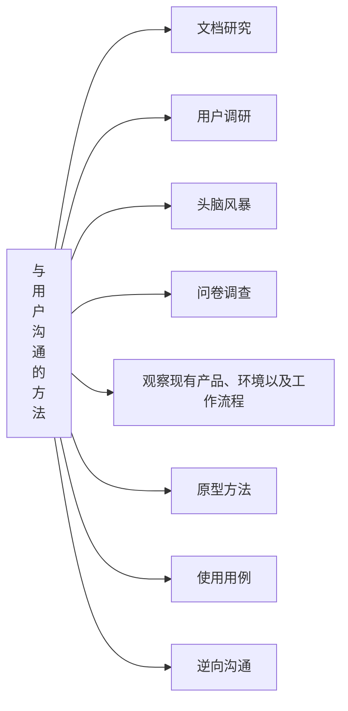
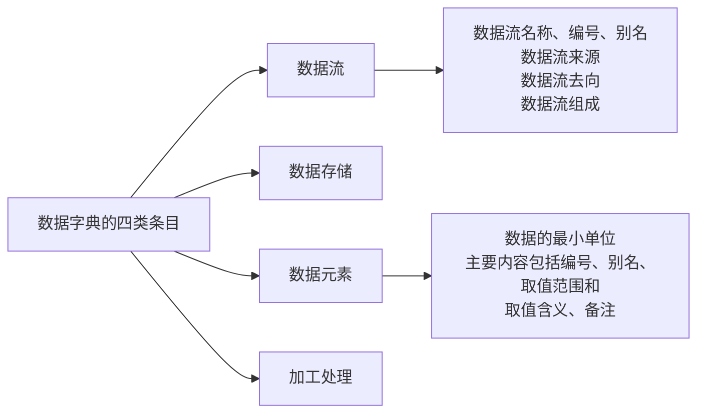

# 软件需求
**重要性**：软件需求是决定软件开发是否成功的关键因素
**定义**：（1997年，IEEE工程标准）
1. 用户解决问题或系统目标所需要的**条件**
2. 为满足一个协约、标准、规格或其他正式制定的文档，系统或系统构件所需要满足和具有的**条件或能力**
3. 对上述条件文档化的描述

## 需求分析的任务
### 需求分析任务
1. 确定对系统的综合要求：
   - 功能需求：系统必须提供的服务功能
   - 性能需求：系统必须满足的约束条件
   - 可靠性和可用性需求：可靠性定量、可用性量化
   - 出错处理需求：错误响应机制
   - 接口需求：应用系统与环境通信格式常用的用户接口需求、硬件接口需求、软件接口需求、通信接口需求
   - 约束：用户或环境强加的限制条件（工具、语言等）
   - 逆向需求：系统不应该做什么
   - 将来可能提出的要求：将来可能要实现的需求
2. 分析系统的数据要求
3. 导出系统的逻辑模型
4. 修正系统开发计划

### 基本任务（结构化需求分析法）
准确定义系统的目标，回答“系统必须做什么？” 
（任务承担者：需求分析小组或系统分析员。）

### 结构化需求分析的三种模型
**模型**：是指为了理解事物而对事物做出的一种抽象，是对事物的一种无歧义的书面描述。
- 数据模型：描述问题信息域，描述数据对象以及数据对象之间的关系 —— 实体-联系图
- 功能模型：定义软件功能，描述数据在系统中流动时被处理的逻辑过程，指明系统具有的变换数据的功能 —— 数据流图
- 行为模型：描述软件行为，描绘系统各种行为模式在不同状态之间的转换模式 —— 状态转换图

### 需求分析的三个阶段
1. 需求获取阶段（问题+分析）
2. 需求规约/规格说明阶段（需求描述）
3. 需求验证阶段（需求评审）

#### 需求获取阶段
1. 任务：
   通过多种方式（与用户交流、实践等）清晰地理解所需要解决的问题，完整获取用户的需求。
2. 方法：
   - 对用户需求进行**建模**
   - 分析用户的要求和期望
3. 作用：
   - 建模可以从多个不同的视角、不同抽象层次上对问题及目标软件系统进行可视化，以便于用户和系统分析人员对软件功能达成一致；
   - 帮助需求分析人员分析和发现用户需求中的不一致性，分析其中的不合理部分，挖掘潜在的用户需求；
   - 有助于形成需求规格说明书；

#### 需求规约阶段
1. 任务：以需求分析模型为基础，考虑到问题的软件可解性，生成软件的需求规格说明书和初步的用户手册
2. 原则：
   - 确保需求规格说明书对用户需求描述的完整性、一致性和准确性（满足需求的质量属性）
   - 鼓励用户参与需求规格说明书以及用户手册的制定

#### 需求验证阶段——需求评审
1. 任务：让用户和设计人员对需求规格说明以及用户手册的理解达成一致
2. 原则：
   - 确保需求规格说明书和用户手册是一致的、完全和准确的（需要满足需求文档的质量属性）
   - 各方（用户、需求分析人员、设计人员）参与评审工作

## 需求工程
### 需求的分类
用户对软件的要求可以分为功能要求和非功能要求两大类；通常一开始是产品的功能需求取胜，时间长了之后，产品的非功能需求取胜。
1. 功能需求：描述系统应该提供的功能或服务，通常涉及用户或外部系统与该系统之间的交互，一般不考虑系统实现细节
   比如：在转盘界面上显示学生姓名和学号
2. 非功能需求（用户体验）：从各个角度对系统的约束和限制，反映了应用对软件系统质量和特性的额外要求，例如响应时间、数据精度、可靠性、开发过程的标准等
   例子：
   - 系统5秒内响应声控请求（性能要求）
   - 对于一个没有经验的用户，经过2小时培训可以上手使用系统所有功能（可用性要求）

#### 非功能需求——可用性相关概念
非功能需求主要分为两大类，性能要求以及可用性要求，这里重点关注一下可用性要求。
可用性相关概念：
- 程序错误：系统没有按程序员意图工作
- 功能需求遗漏：系统无法执行某一项任务
- 可用性问题：系统既无程序错误，又功能需求遗漏，但是用户仍然不知道如何使用系统执行任务或者不喜欢使用系统执行任务
描述可用性的例子（在文档中写需求分析的可用性部分时可以这样写）：
1. 可以使用键盘完成所有操作
2. 将显示内容分为两部分（基本和高级），基本部分默认显示，高级部分只有用户需要才显示

## 需求获取的方法
### 需求获取中存在的问题
需求获取中用户、系统分析员、程序员等各方都存在各自的问题，导致需求获取不准确，浪费人力物力资源。
1. 用户存在的问题：**“拍脑袋”**，想起一出是一出，不知道或者不能明确表达自己的需求
2. 系统分析员存在的问题：**“拍脑袋”**，认为自己比用户更明白用户的问题；**“拍胸脯”**，认为自己能实现用户提出的所有问题
主要原因：背景差异，不能有效沟通

### 需求获取的过程
需求获取的**关键在于通过与用户的有效沟通与交流**，收集和理解用户的各项要求。
需求获取的过程如下图：

### 与用户沟通的方法

#### 文档研究
内容：收集和分析文档（比如收集工作手册、行业手册、报表、旧系统设计文档......），根据目前的文档资料分析用户的业务过程，为下一步工作储备必须的背景知识
需要注意的问题：
1. 文档资料重复
2. 文档资料冲突
3. 有些资料是被废弃的

好处：
1. 根据目前的文档资料分析用户的业务过程，为下一步工作储备必要的**背景知识**
2. 和用户的沟通建立在相同的背景知识上，沟通才是有效的

#### 需求调研
需求调研是一种理解商业功能和商业规则的最有效的方法；
个人理解：就是通过访谈等形式，和相关方进行直接沟通，经过充分沟通后获取相关方需求

##### 需求调研的过程
**调研之前**（认真的计划和准备）：
1. 查阅有关文档和资料，对业务有一个基本的理解
2. 建立调研提纲（列出 要调研的问题和要点）
3. 建立调研计划（什么时间、什么地点），调研提纲需要提前提交给用户，使用户有所准备
4. 通知所有参加者有关调研的目的、时间和地点
5. 调研用户的顺序最好是：管理人员 ——> 业务人员
**调研过程中**：（有效地听取）
1. 善于诱导用户把问题描述完整
2. 深入调查细节
3. 有完整的详细记录
4. 对未明确、有歧义的问题应该特殊标记
**调研完成后**：
1. 复查记录的准确性、完整性和可理解性
2. 把收集的信息转化为适当的模型和文档
3. 确定需要进一步澄清的问题域
4. 会议记录发送给参加会议的每一个人员（不同人背景不同。尽量处于统一背景进行有效沟通）

##### 需求调研的提问方法
**5W1H**：
1. WHO，用户角色
2. WHAT，完成什么功能
3. WHERE
4. WHEN
5. WHY，这些功能要达到什么目的，或为什么有这些功能
6. HOW
7. Competitors，竞争对手的功能是什么样的？相比优点和缺点如何？

**与用户有效沟通的方法还有：头脑风暴、问卷调查、现场观察、逆向沟通等方法，可以看PPT了解一下，感觉不是重点，就不整理了，PPT的42-45页**

## 分析建模与需求规格说明书

### 需求分析和建模
需求分析的目的：
分解需求、提炼需求，并且在这个过程中消除出现的矛盾，和客户需求达成一致；

提炼需求：
1. 分解过程中出现需求相互重叠的情况，需要提炼需求，抽取共性
2. 分解过程中可能出现相互矛盾的情况，这时需要平衡

### 需求建模
需求分析的主要方法和手段——需求建模
需求建模目的：帮助需求分析人员理清楚思路，帮助和客户达成一致

**建模的工具和方法论**（个人觉得重点概念）
1. 结构化方法（Structrue Analysis）
2. 面向对象方法

### 需求分析方法——结构化方法
面相数据流进行需求分析，适合于数据处理类型的软件的需求分析

#### 需求分析基本目标
1. 描述用户对软件系统的需求
2. 为软件设计奠定一个良好的基础
3. 定义一组需求，并且可以作为软件产品验收的标准

#### 需求分析模型的内容
1. 数据字典
2. 数据模型（用实体联系图表达）
3. 功能模型（用数据流图表达）
4. 行为模型（状态转换图表达）

#### 功能建模——数据流图的绘制（多层次数据流图）
数据流图的定义：
描述**数据处理过程**的工具，通过图形的方法，从**数据传输和数据处理**的角度，刻画数据流从输入到输出的移动变换过程。

核心思想是自顶向下的分析方法，先抽象再具体，逐层分解！

绘制思路方法：
**注意一个原则：分解前后的外部输入输出的数据流一致**
一、画顶层（只有一个处理，即一个圆框）：
1. 画出系统的输入和输出——确定起点和最终输出终点，一般起点和最终输出终点都是数据流之外的元素，比如考试管理系统的考生、考试中心；这部分识别出来的体用方框表示
二、画中间层（可以有多层）：
1. 在第上一层的基础上进行分解
三、画底层：
1. 底层图由一些不能再分解的加工组成，这些加工已经足够简单，称为**基本加工**

绘制数据流图技巧个人经验：
1. 先抽象出顶层，一个处理，然后确定输入输出
2. 对处理进行分解，主要抓住动词、动作，作为数据处理部分
3. 根据抓住的数据处理部分，分析需要什么数据流输入输出
4. 时刻记得子图与父图的平衡

绘制数据流图的原则：
1. 数据流的命名一定都是名词（数据应该都是名词，比如学号、申请单等等）
2. 每一个加工都是一个动作
3. 每一个加工都必须至少有一个输入流和一个输出流
4. 数据不能从外部直接流入数据存储，即数据存储的直接输入输出对象都必须是加工
5. 数据流要保持守恒，加工输出的数据要有对应的数据来源
6. 保持父图与子图的平衡
7. 除了顶层数据流图，每个加工都要有标号，并且遵守标号的规则，标号不表示功能的执行顺序
8. 下层数据流图应该与上层数据流图等价
9. 一个加工的输入数据流和输出数据流不能同名（加工之后还是自己，不就是没加工）
10. 每一个文件应该至少有一个加工读它，至少有一个加工写它
11. 尽量避免数据流图的交叉

练习题以及解答：
<iframe src="https://player.bilibili.com/player.html?isOutside=true&aid=603176382&bvid=BV1gB4y1H7MR&cid=838366587&p=1" scrolling="no" border="0" frameborder="no" framespacing="0" allowfullscreen="true" style="width:640px; height: 430px; max-width: 100%;"></iframe>

#### 数据建模 —— 实体联系图（E-R图）
1. 实体： 描述数据对象
2. 属性： 描述数据对象的性质
3. 联系： 描述数据对象之间的交互方式
   - 1对1
   - 1对多
   - 多对多
数据库学过，这里不赘述

#### 行为建模 —— 状态转换图
**定义**：状态转换图是一种描述系统对内部或外部事件响应的行为模型
**状态**：系统的行为模式，包括初态、终态、中间状态
**事件**：是指在某个特定时刻发生的事情，即对系统从一个状态转换到另一个状态的事件抽象，状态转移通常由事件触发

表示方式：
1. 初态：实心圆
2. 终态：同心圆，内为实心
3. 中间状态：圆角矩形
**一张状态图中只能有一个初态，而终态可以有0个或者多个**
例图：

各个状态的表达结构：
1. 中间状态：可以用两条水平线分为上中下三部分
   上部：状态名称
   中部：状态变量的名字和值，可选
   下部：活动表，可选
2. 中间状态的活动表的语法格式：
   事件名（参数）/动作表达式
   常用的3种标准事件：
   - entry，指事件指定进入该状态的动作；
   - exit，指事件指定退出该状态的动作；
   - do，指事件在该状态下的动作；

3. 事件表达式语法：
   事件说明[守卫条件]/动作表达式
   事件说明：事件名（参数表）
   守卫条件：布尔表达式；如果同时使用事件说明和守卫条件，则当且仅当事件发生且布尔表达式为真时，状态才发生转换
   动作表达式：过程表达式，当状态转换开始时执行该表达式

例题以及答案：
假设航空订票系统的航班状态有无预定、部分预定、预定关闭和预定完成四个状态，请绘制出状态转换图。

#### 数据字典
数据字典是对**数据流图中包含的所有元素的定义的集合**，使得每一个图形元素的名字都有一个精确的、严格的定义。
> 数据字典可以把不同的需求文档和分析模型紧紧结合在一起，如果所有开发人员在数据字典上去的一致意见，那么可以缓和集成性的问题。为了避免**冗余和不一致性**，应该在项目中创建一个**独立的数据字典**

数据字典的构成：

**工业上，数据字典的每一类条目都用一张表表示并编号，做成卡片，方便查询**
##### 数据结构
由若干个数据项或数据结构组成，把关系密切的数据组合在一起
主要内容：名称、编号、数据结构的组成

##### 数据元素/数据项
数据项的名称、编号、别名、取值范围和取值含义、备注
例：

##### 数据流
数据流图中，数据以数据流为单位进行传输
主要内容：
- 数据流名称、编号、别名
- 数据流来源
- 数据流去向
- 数据流组成
例子：

##### 数据存储
保留或者保存数据的地方
内容：
数据存储名称、编号、数据存储的组成（包括数据项或数据结构）

##### 加工逻辑
主要内容：
名称、编号、加工逻辑的输入和输出、加工逻辑的说明
**对基本加工的逻辑要做明确的描述**
基本加工是指底层数据流图中，不能再拆分的加工

##### 数据字典常用符号

## 验证软件需求
### 需求的质量属性
1. 正确性：需求规格说明对系统功能、行为、性能等的描述必须与用户期望相符合，代表了用户真正的需求；
2. 完整性：需求规格说明应该包含软件要完成的全部任务，不能遗漏任何必要的需求信息；
3. 一致性：需求规格说明对各种需求不能存在矛盾，如术语使用冲突、功能和行为特性方面的矛盾等等；
4. 无歧义性：需求规格说明中的描述对于所有人都只能有一种明确的解释；
5. 可验证性：需求规格说明中描述的需求都可以运用一些可行的手段对齐进行验证和确认；
   比如：不能存在不可验证的陈述，如“用户界面友好”；描述需要可测量，比如系统将在20秒内响应所有请求；
6. 可跟踪性：每一项需求都能与其对应的来源、设计、源代码和测试用例联系起来；
### 需求验证的技术
**需求验证主要围绕需求规格说明书的质量特性展开**
- 需求评审：由不同代表（如分析员、客户、设计人员、测试人员）组成的评审小组以会议形式对需求进行系统性分析；
- 原型评价：客户和用户在一个可运行的系统模型上实际检验系统是否符合他们的真正需要；
- 测试用例生成：通过设计具体的测试方法，发现需求中的许多问题；
- 形式化分析和验证

## 需求规格说明书
需求规格说明书按照需求分析设计方法不同而不同，PPT上只涉及到**结构化设计**的需求规格说明书；
结构化需求规格设计书是按照**用例**组织的需求规格说明书；
**例子**（以后如果要写文档可能参考用得到）：

### 软件需求规格说明书（SRS）
#### 主要目的
- 便于用户、分析人员和软件设计人员进行理解和交流
- 目标软件系统的最终验收和确认的标准

#### 组成部分
1. 总体描述部分
   - 系统给谁用的？使用目的是什么？
   - 系统的使用场景是什么？整体性的流程是什么？（可用UML活动图或系统流程图来表示）
   - 使用者需求列表与说明
2. 详细需求：对于每一个需求至少描述4个部分：功能、性能、设计约束和接口
   - 功能的描述：
     描述系统中输入域输出之间的关系（类似于数据流图中的数据处理部分），描述清楚给定什么输入产生什么输出；
     描述为了得到输出而在输入数据上做的相关操作；
     描述系统在异常情况下的行为，如非法输入（有多种情况出现）或者计算中的错误；
     **多用ER图、DFD图、IPO图等来描述功能需求**
 3. 外部接口：所有**软件与人、硬件和其他软件的交互**都得明确描述，包括用户操作命名、屏幕显示格式、打印格式、系统如何呈现给用户的解反馈和错误消息等；

#### 应对需求变化（扫一眼就行）
在软件开发中唯一不变的是需求变化。
**应对需求变化的措施**：
1. 控制需求变化：
   - 让变化按照严格定义好的变更流程来进行
   - 让所有人明白需求变化带来的影响
2. 设计良好的软件架构以应对需求变化

考试透露：
1. 类图（肯定有！）
2. 活动图
   用例图（图形编辑）
   用例图：用户使用功能的例子的说明图！！！
3. **测试**（占比较大）！！！  PPT以及讲课有涉及到
   源于教材和PPT的测试用例
3. 设计案例！！！  PPT和讲课有涉及到
   数据流图、XXX图
4. 项目估算（要知道有什么估算方法）：
   代码行
   功能点（好写）
   投入人员（好写，投入多少人，做多少天）
   ...
5. **等价分类测试**，重点！占比很大！
6. 做界面，第三类的倒数第四点：参考图书管理系统和人事系统
7. 实体图、类图
   实体图和类图要考虑细节一些，不要太简单

